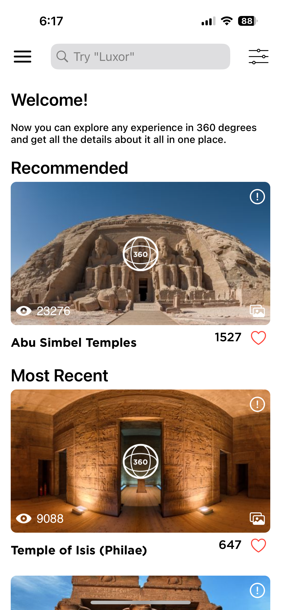
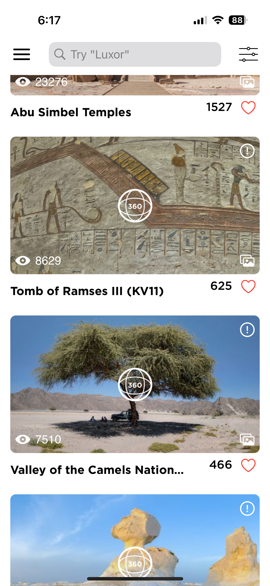

# Around Egypt iOS App

Around Egypt is an iOS application developed as a task project for a company. The app provides access to information about various places in Egypt through two primary pages, leveraging an API to fetch relevant data.

## Features
- Displays information about different locations in Egypt fetched from an external API
- Caches fetched data and images locally using Realm database for improved offline access
- Allows users to like/favorite places locally, storing the liked data locally on the device
- Utilizes a blend of UIKit and SwiftUI for the user interface, providing a seamless user experience
- Implements Alamofire for networking tasks, enabling efficient API interactions
- Utilizes RxSwift to handle reactive programming and streamline data flow within the app
- Programmatic UI creation for UIKit components ensures flexibility and customization
- Includes unit tests to ensure the stability and reliability of core functionalities

## Technologies Used
- UIKit
- SwiftUI
- Alamofire
- Realm Database
- RxSwift
- Unit Testing

## Usage
To run the project, clone the repository and open it using Xcode. Ensure you have the necessary dependencies installed using CocoaPods or Swift Package Manager. Use Xcode's built-in testing features to run unit tests.

## Contributing
Contributions are welcome! If you encounter any issues or have suggestions for improvements, please open an issue or submit a pull request.

## License
This project is licensed under the [MIT License](LICENSE).
